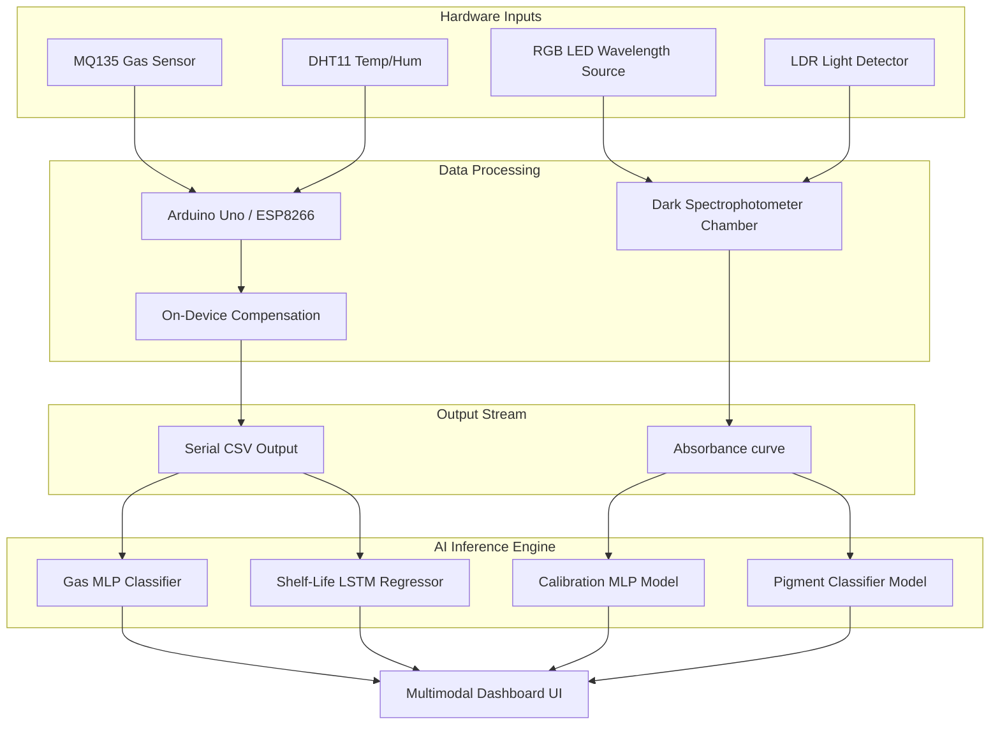

# FoodSense AI: Multimodal Spoilage Prediction System 🥦

[](https://huggingface.co/spaces/aditya-ranjan1234/foodsense-ai)
[](https://opensource.org/licenses/MIT)
[](https://www.python.org/downloads/)

FoodSense AI is a state-of-the-art IoT + AI pipeline designed for **early food spoilage detection**. Unlike traditional systems that only provide binary "Fresh vs. Rotten" snapshots, FoodSense uses temporal attention-augmented LSTMs to predict **continuous remaining shelf-life** in hours.

## 🌟 Key Features
- **Multimodal Spoilage Tracking**: Combines Gas VOC (Ammonia), Temperature, and Humidity sensors.
- **On-Device Compensation**: Microcontroller-level correction for sensor drift caused by environmental changes.
- **Temporal Attention LSTM**: Specifically designed to capture the "velocity of spoilage" over time.
- **99.75% Classification Accuracy**: Robustly identifies Ammonia signatures using lab-validated UCI datasets.

---

## 🏗️ System Architecture

### 1. Hardware Pipeline (Arduino/ESP32)
The hardware layer performs real-time sampling and **empirical temperature-humidity compensation** for the MQ135 sensor to ensure data integrity before it even reaches the AI models.



### 2. AI Model Suite
| Model | Architecture | Purpose |
|---|---|---|
| **Gas MLP** | 3-Layer Deep MLP | Instant classification of Ammonia (Spoilage marker) vs. Safe gases. |
| **Shelf-Life LSTM** | Attention-Augmented LSTM | Continuous regression to predict remaining shelf-life in hours. |
| **Vision Branch** | MobileViTv2 (Planned) | Surface discoloration and mold detection using Vision Transformers. |

---

## 📊 Model Performance

### Gas Classifier (MLP)
Validated on the **UCI Gas Sensor Array Drift Dataset** (13,910 samples).
| Metric | Result |
|---|---|
| **Accuracy** | **99.75%** |
| **Precision** | **99.08%** |
| **Recall** | **98.78%** |
| **F1-Score** | **98.93%** |

### Shelf-Life Predictor (LSTM)
The model can predict the remaining shelf-life within **±4.0 hours** of accuracy based on current sensor trajectories.

---

## 🔬 Project Novelty
FoodSense fills critical gaps in existing food-safety research:
1. **Low-Cost Precision**: Replaces expensive e-noses with $2 consumer sensors through advanced signal processing.
2. **Temporal Modeling**: Uses **LSTM with Attention** to prioritize specific spoilage events in the timeline.
3. **Continuous Regression**: Moves beyond binary classification to provide a usable "hours remaining" metric.

---

## 📂 Project Structure
```
.
├── arduino_code/            # Optimized sketches with on-device compensation
├── dataset/                 # UCI Drift dataset and local Arduino logs
├── docs/                    # Detailed PROJECT_EXPLANATION.md & Metrics
├── huggingface_space/       # Static UI files for HF Spaces deployment
├── models/
│   ├── src/                 # PyTorch training & testing scripts
│   └── saved_weights/       # Pre-trained .pth model weights
├── .github/workflows/       # Automated HF Sync Action
└── README.md
```

---

## 🏁 Getting Started

### 1. Setup Environment
```bash
# Create and activate venv
python -m venv venv
.\venv\Scripts\Activate.ps1

# Install dependencies
pip install torch pandas numpy scikit-learn ucimlrepo requests
```

### 2. Train and Test
```bash
cd models/src
# Train the Gas Classifier
python train_mlp.py
# Train the Temporal Shelf-Life model
python train_lstm.py
```


---
